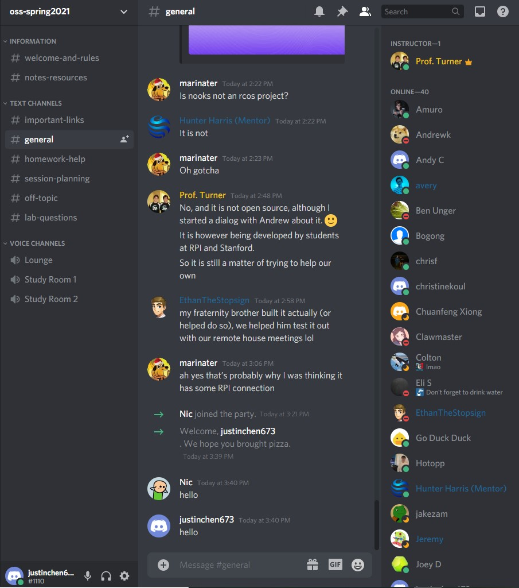
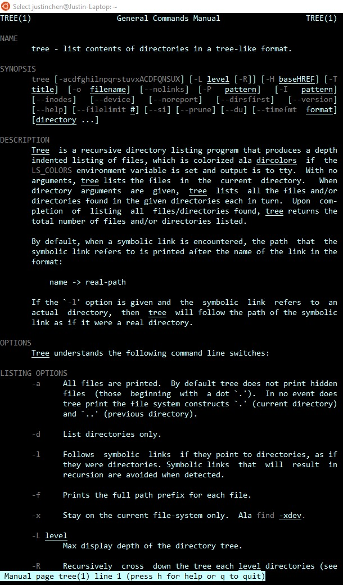
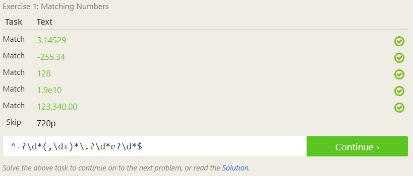
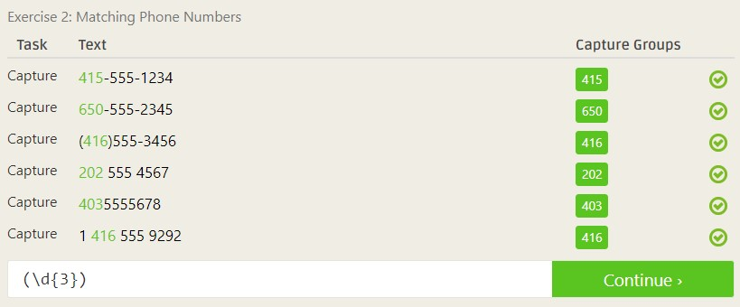
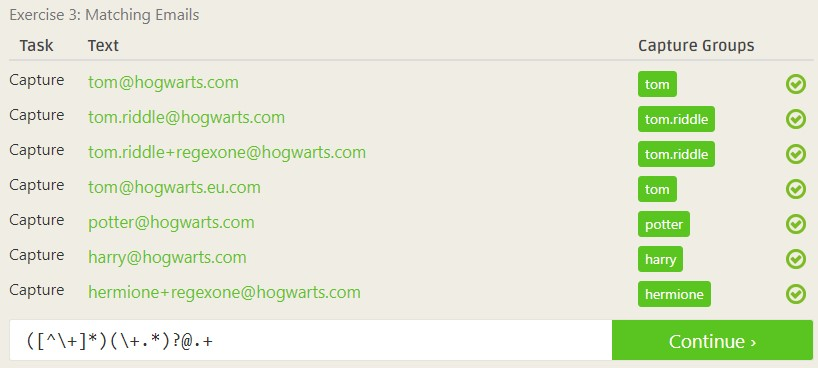
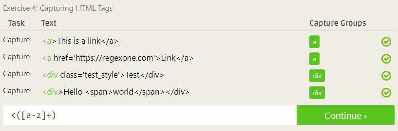
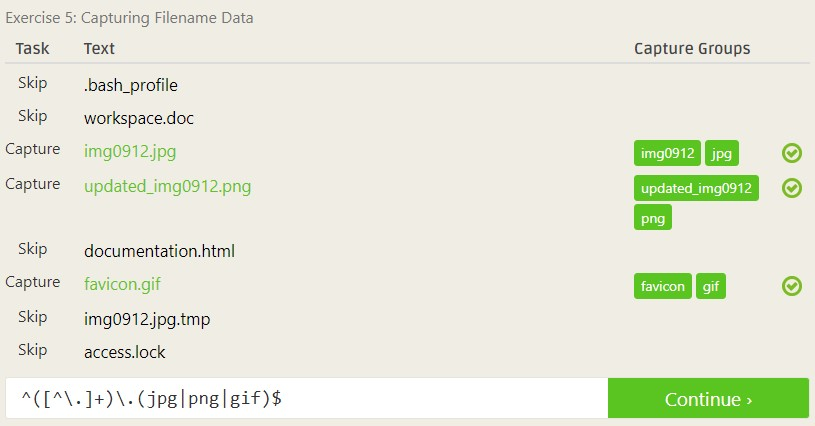
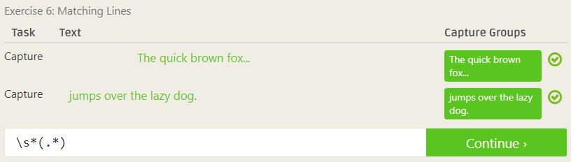
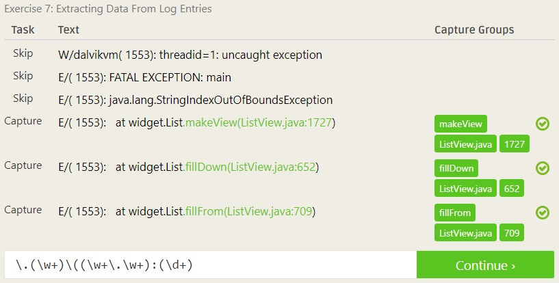

# Lab 01 Report - Introduction to Open Source Software

## Discord Screenshot

## 2 Suggestions for Answering Questions

- Instead of giving outright answers, give the individual pointers and
information that can help the asker derive the answer for themselves.
- Provide additional resources that the asker can read into that pertain to the
original question.

## Tree Screenshot

## Regex Screenshots

