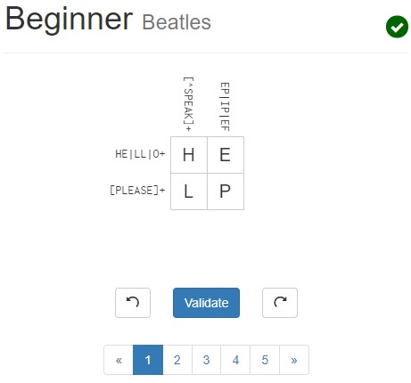
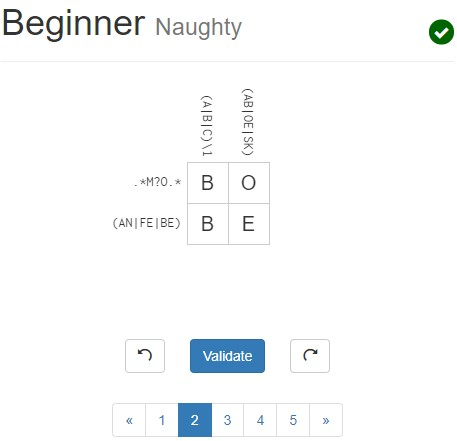
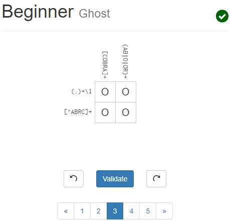
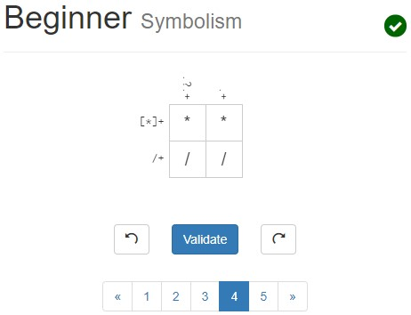
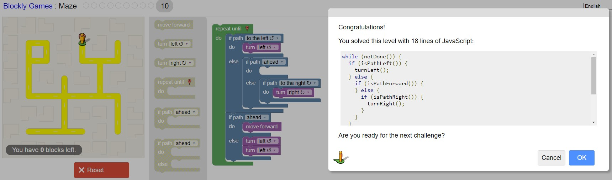

# Lab 01 Report - Introduction to Open Source Software

## Discord Screenshot

## 2 Suggestions for Answering Questions

- Instead of giving outright answers, give the individual pointers and
information that can help the asker derive the answer for themselves.
- Provide additional resources that the asker can read into that pertain to the
original question.

## Free Culture

I think the biggest takeaway from the reading was how unintended consequences
could come as a result of a created product. Despite the fact that Jesse didn't
create the engine to support piracy, it ended up doing just that. It can be
argued that Jesse shouldn't receive any blame at all, and that the suit was not
just, which is a position I support. However, until the legal system changes,
it seems like protecting yourself should be the number 1 priority. So, whenever
you develop software, you should consider how people using the software could
potentially abuse it for illegal activities. If that is the case, it is in your
own personal self interest to ensure that those functionalities do not get
released. If that functionality is core to the product, possibly speak with a
legal expert to work on arranging some sort of terms of service that shift
responsibility away from you should the product be abused. Again, in an ideal
world this would not be necessary, but the system forces you to do so to protect
yourself.

## Tree Screenshot

## Regex Screenshots

## Crossword Screenshots

## Blockly Screenshot

## Reflection

I would like to evaluate Git, as it's an extremely common software piece that
almost all developers use at some point in their lives. I think the most
interesting aspect of it is how it can analyze and track changes to
intelligently find conflicts, as well as the structures used with Git to track
all different versions as well as their relative branches. Since it's a huge
open source project, I think it would be best to focus on specific features.
