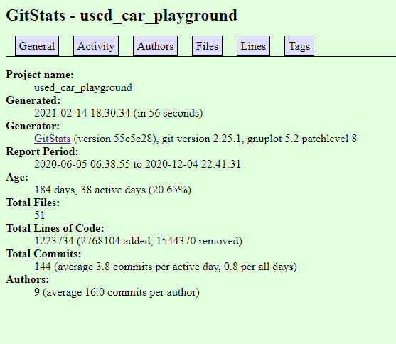

# Lab 3

## Part 1

### Latex Code

```latex
\documentclass[11pt]{res}
\usepackage{amsmath, xparse}

\begin{document}

	$$
	\sqrt{1+2\sqrt{1+3\sqrt{1+4\sqrt{1+\dots}}}}
	$$
	\newline
	$$
	{\sqrt{2}}^{\sqrt{2}^{\sqrt{2}^{\sqrt{2}\dots}}}
	$$
	\newline
	$$
	\begin{bmatrix}
	1 & 1 & 1 & 1 \\
	-1 & 1 & -1 & 1 \\
	-1 & -1 & 1 & 1 \\
	1 & -1 & -1 & 1
	\end{bmatrix}
	$$

\end{document}
```

### Screenshot


## Part 2

### YACS

#### Manual Stats

- Number of Contributors: 18
- Number of Lines: 44600
- First Commit: "initial commit" by jshom, committed on Feb 25, 2020
- Last Commit: "Update spring 2021 csv" by marchdan, committed on Feb 3, 2021
- Branches:
    - 52-scheduling
	- 280-loadPageSpinner
	- 338-mobile-ui-revised
	- add_vuex
	- admin_panel_ui
	- coursePage-recommendation
	- create-pull-request/patch
	- csv-fix
	- dark-mode
	- fixTimeSpring2021CSV
	- page_for_department
	- s21
	- seo
	- showDatabaseError
	- shruti_yacs
	- spring_2021_update
	- subject_fail_reload
	- summer2020-demo
	- windows_support
	- #230
	- #259

#### Gitstats


It appears that there are slightly less lines of code on Gitstats but slightly
more contributors.

#### Gource


### Venue

#### Manual Stats

- Number of Contributors: 16
- Number of Lines: 562692
- First Commit: "initial commit" by tdurkin18, committed on Oct 1, 2019
- Last Commit: "redact numfor’s password" by TheStopsign, committed on Dec 30, 2020
- Number of Branches: 54

#### Gitstats


The lines of code and the number of contributors are different. Gitstats states
that there are 61159 lines while Github states that there are 562,692 lines.
Gitstats also states that there are 25 contributors while Github states that
there are 16 contributors.

#### Gource


### Used Car Playground

#### Manual Stats

- Number of Contributors: 6
- Number of Lines: 1251051
- First Commit: "Update map.r", committed on Nov 13, 2020
- Last Commit: "11/15 update", committed on Dec 4, 2020
- Branches:
    - master
    - LOGO&backGround
    - selenium
    - song_xu_patch_1
    - bokehapp
    - data_analysis_on_maps

#### Gitstats


It seems as if the number of lines between whats shown on the website and whats on github are different.

#### Gource


