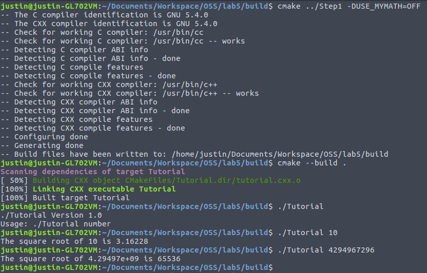

# Lab 5

## CMake Tutorial

### Steps 1 and 2

- [Modified tutorial.cxx](tutorial_Step1and2.cxx)
- [CMakeLists.txt](CMakeLists_Step1and2.txt)
- 

### Step 3

- [CMakeLists.txt](CMakeLists_Step3.txt)
- [MathFunctions/CMakeLists.txt](MathFunctions_CMakeLists_Step3.txt)
- 

### Step 4

- [CMakeLists.txt](CMakeLists_Step4.txt)
- [MathFunctions/CMakeLists.txt](MathFunctions_CMakeLists_Step4.txt)
- 

### Step 5

- [CMakeLists.txt](CMakeLists_Step5.txt)
- [MathFunctions/CMakeLists.txt](MathFunctions_CMakeLists_Step5.txt)
- 
