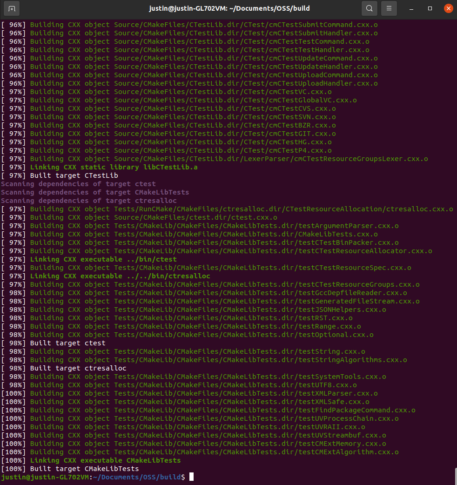
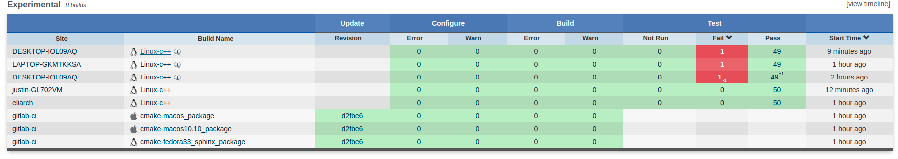
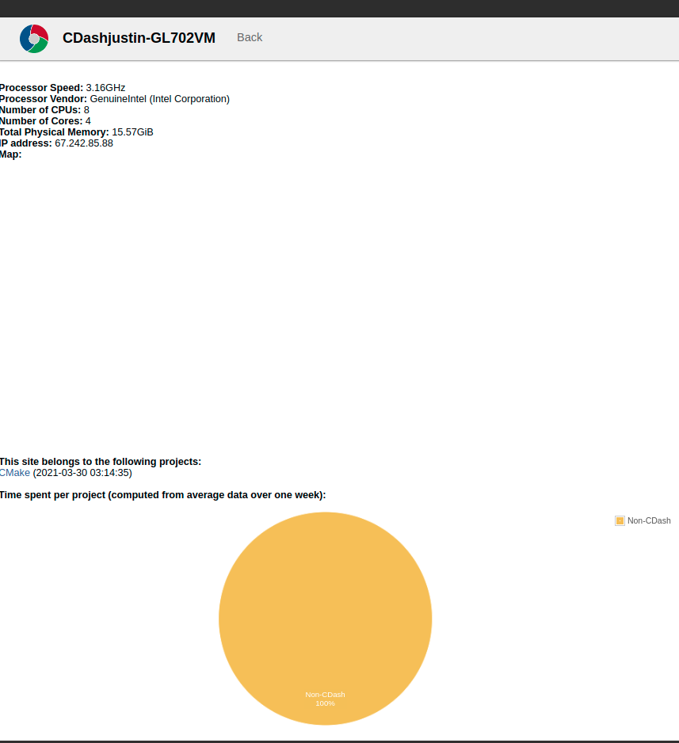
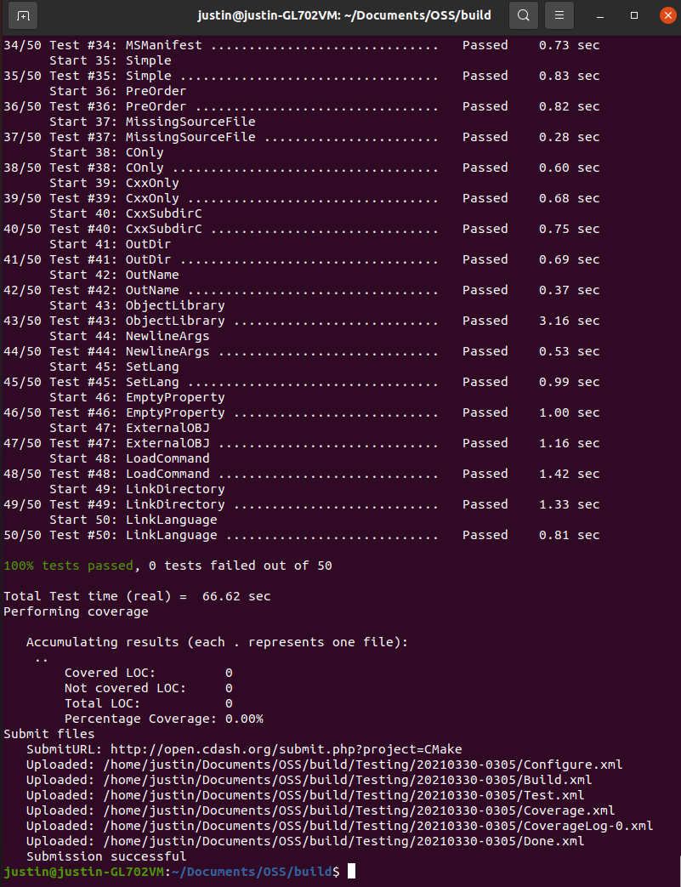
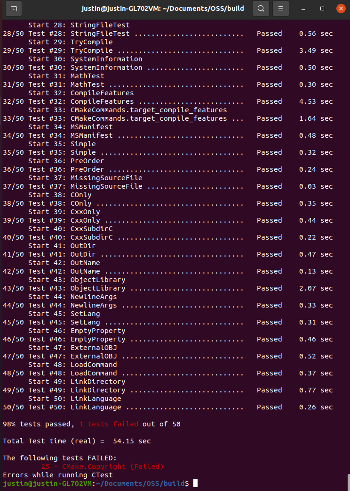
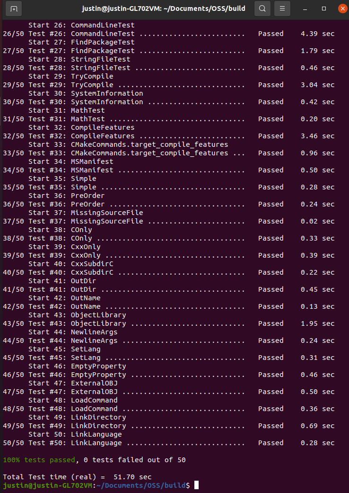

# Lab 7

## Checkpoint 1



## Checkpoint 2

- How can you see what tests were run for a particular submission?
	- There is a column with multiple sub-columns for this. It informs the user
	how many failures or passes there were, also allowing the user to follow a
	hyperlink to view the tests in detail.
- Can you see what the error condition was? How does this help you debug the
	failure?
	- Yes: for the one I looked at, it said that SetPermissions failed to set
	permissions and SetPermissions failed to honor umask.
	- The error messages inform you of the file that caused the error as well as
	actual and expected values.
- How clean is the dashboard? Are there any errors that you need to be
	concerned with?
	- It is relatively clean, as each section is properly segmented off.
	- It also appears that there are not any errors to be concerned with,
	as this particular configuration (Ubuntu20.04.1) ran 657 tests and has no
	errors / warnings.
- Are there errors in your submission? If so, are they consistent?
	- There are no errors.





## Checkpoint 3



- I found the error cause by looking at the test. The issue was that the
following text wasn't included:
```
Copyright 2000-2021 Kitware, Inc. and Contributors
and the current version year is 2021.
```


