# Lab 9

## Checkpoint 0

[Blog Post](https://rcos.io/projects/justinchen673/royal-flush/blog)

## Checkpoint 1

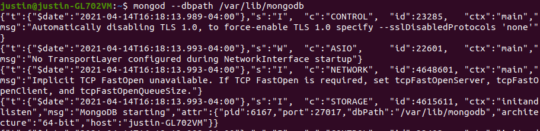
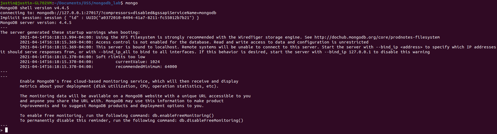

## Checkpoint 2

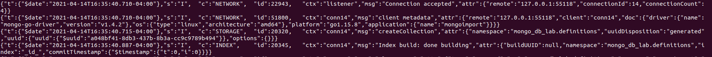

## Checkpoint 3

Note: It took me a couple tries to get the update to work, so there are multiple
updated definitions.

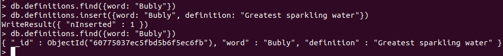
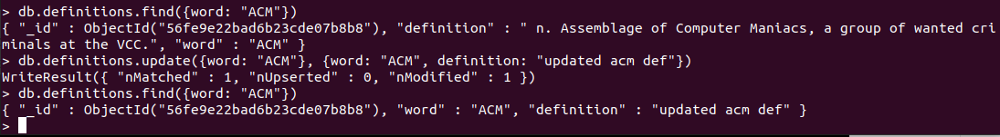
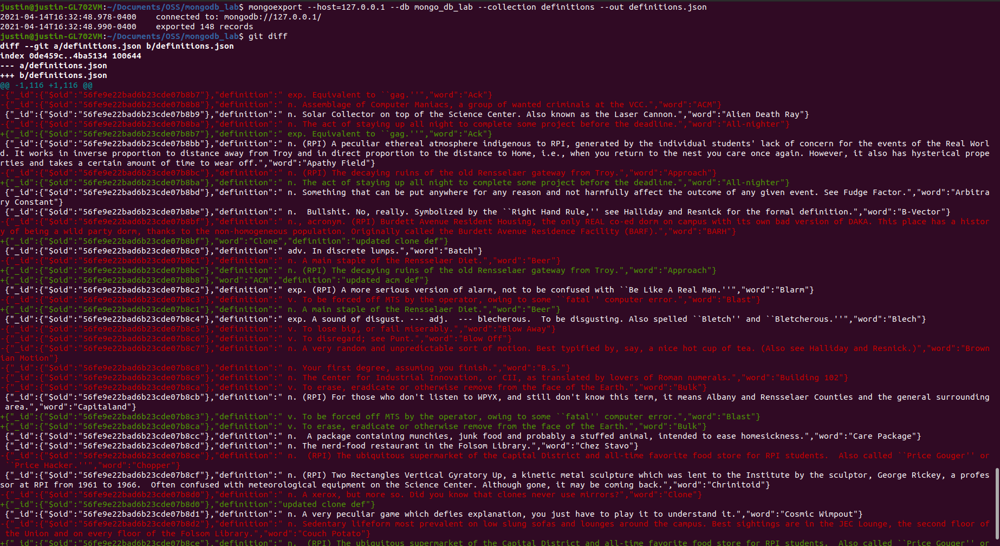

## Checkpoint 4

[Forked checkpoint4.py](https://github.com/justinchen673/mongodb_lab/blob/master/checkpoint4.py)

### Fetch All
#### Code
```python
def fetchAll(collection):
    for doc in collection.find():
        pprint.pprint(doc)

fetchAll(defs)
```
#### Output
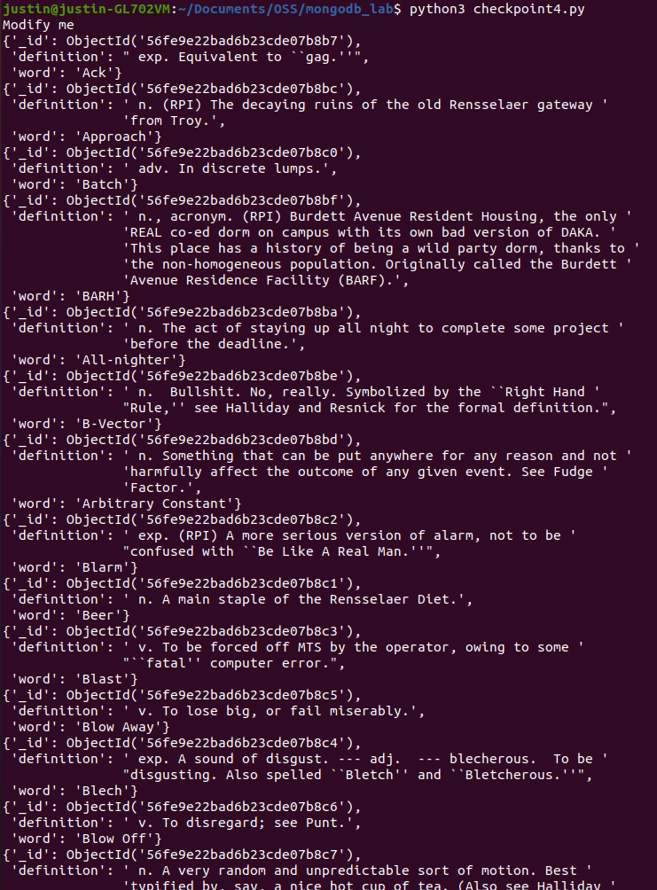

### Fetch One
#### Code
```python
def fetchOne(collection):
    pprint.pprint(collection.find_one())

fetchOne(defs)
```
#### Output
![fetchOne][fetchOne.png]

### Fetch Specific
#### Code
```python
def fetchSpecific(key, value, collection):
    pprint.pprint(collection.find_one({key: value}))

fetchSpecific("word", "Clone", defs)
```
#### Output
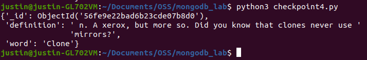

### Fetch By ID
#### Code
```python
def fetchById(id, collection):
    pprint.pprint(collection.find_one({"_id": ObjectId(id)}))

fetchById("56fe9e22bad6b23cde07b949", defs)
```
#### Output
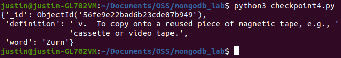

### Insert Record
#### Code
```python
def insertRecord(query, collection):
    pprint.pprint(collection.insert_one(query))

insertRecord({"word": "Bubly", "definition": "Greatest sparkling water"}, defs)
```
#### Output
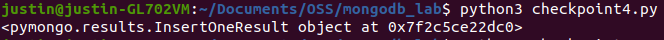


## Checkpoint 5

[Forked checkpoint5.py](https://github.com/justinchen673/mongodb_lab/blob/master/checkpoint5.py)


```python
import datetime
from random import randrange
import pprint
from bson.objectid import ObjectId
from pymongo import MongoClient
client = MongoClient()

def random_word_requester():
    # Connection to db
    db = client["mongo_db_lab"]
    collection = db["definitions"]

    # Get random document
    randIndex = randrange(collection.count_documents({}))
    count = 0
    for doc in collection.find():
        if (randIndex == count):
            # Add date to the document
            dt = datetime.datetime.isoformat(datetime.datetime.utcnow())
            if ("dates" not in doc):
                doc["dates"] = []
            doc["dates"].append(dt)
            collection.update_one({"word": doc["word"]}, {"$set": doc})

            return doc

        count += 1

if __name__ == '__main__':
    pprint.pprint(random_word_requester())
```

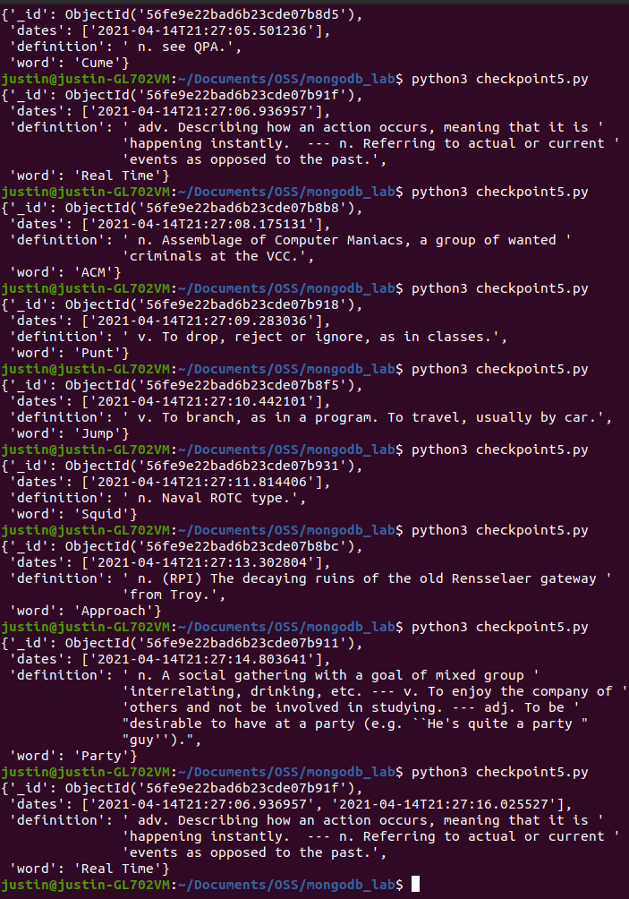
