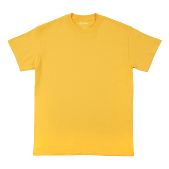

# Lab 10

## Checkpoint 1

## Checkpoint 2

## Checkpoint 3

- Original Bag
	- 
- Processed Bag
	- 
- Original Shirt
	- 
- Processed Shirt
	- 
- Original Dress
	- 
- Processed Shirt
	- 
- Results:
	- Only 1 out of 3 was correctly identified.
	- 
